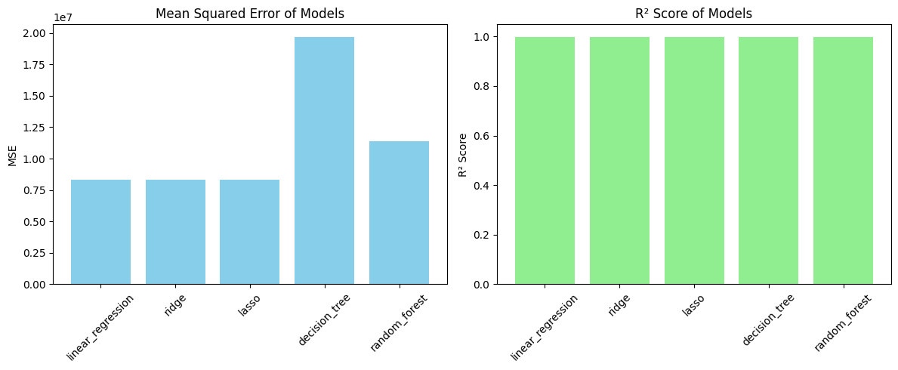

# 📊 Advertising Spend vs Sales – Regression Model Comparison

This project compares the performance of multiple regression models to predict sales based on advertising spend data using various media channels.

---

## 📁 Dataset
- **File**: `advertising_and_sales_clean.csv`
- **Target variable**: `sales`
- **Features**: Various advertising spend amounts (TV, Radio, Social Media, etc.)

---

## 🎯 Objective
To evaluate and compare the performance of different regression models and identify the one that best predicts sales based on advertising budgets.

---

## 🧠 Models Compared
- Linear Regression
- Ridge Regression
- Lasso Regression
- Decision Tree Regressor
- Random Forest Regressor

---

## ✅ Evaluation Metrics for Ridge Regression

| Metric | Value |
|--------|-------|
| Mean Absolute Error (MAE) | `2313.583` |
| Mean Squared Error (MSE) | `8,320,060.233` |
| R² Score | `0.9990` |
| Mean Absolute Percentage Error (MAPE) | `0.0163` |
| Mean Squared Log Error (MSLE) | `0.0006` |
| Explained Variance Score (EVS) | `0.9990` |

➡️ These results indicate that the Ridge model performs **extremely well**, explaining more than 99.9% of the variance in the test set with very low absolute and percentage errors.

---

## 📊 Visual Comparison of Models

| MSE & R² Comparison Across All Models |
|---------------------------------------|
|  |

---

## 📦 Project Structure

```
advertising-sales-regression/
│
├── advertising_and_sales_clean.csv         # Dataset
├── regression_models.ipynb                 # Main notebook
├── README.md                               # This file
├── requirements.txt                        # Dependencies
├── plots/
│   └── MSE_R2_comparisons.png              # Bar plots for MSE and R²
```

---

## 🛠️ Tools & Libraries
- Python
- pandas
- scikit-learn
- matplotlib
- seaborn (optional for advanced visuals)

---

## 🚀 How to Run This Project
1. Clone the repository:
   ```bash
   git clone https://github.com/your-username/advertising-sales-regression.git
   cd advertising-sales-regression
   ```

2. Install dependencies:
   ```bash
   pip install -r requirements.txt
   ```

3. Open and run the notebook:
   - `regression_models.ipynb` (in Jupyter Notebook or Google Colab)

4. Explore the outputs and plots in the `plots/` folder.

---

## 🧠 Future Improvements
- Add hyperparameter tuning using `GridSearchCV`
- Include advanced models (e.g., XGBoost, Gradient Boosting)
- Export and serve the model using Flask or FastAPI

---

## 👤 Author
Ahmed Frahat  
[LinkedIn Profile](https://www.linkedin.com) *(optional link)*

---

## 📃 License
This project is open-source and available under the [MIT License](LICENSE).
